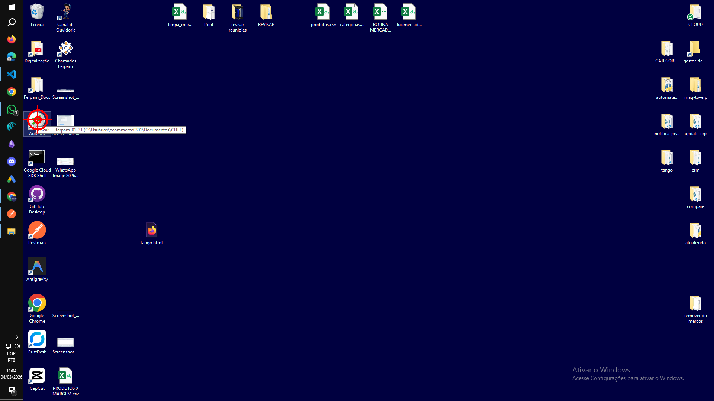
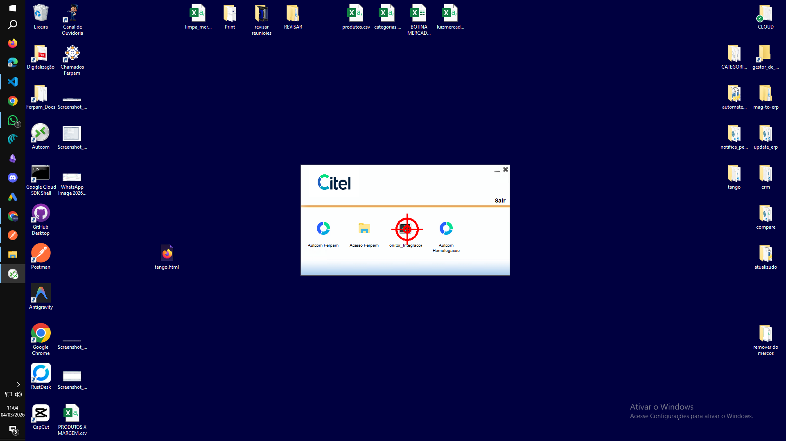
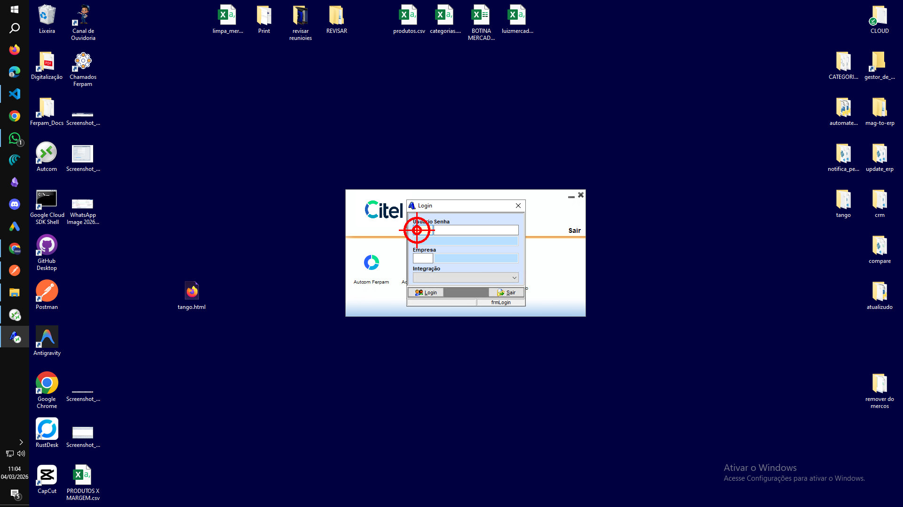
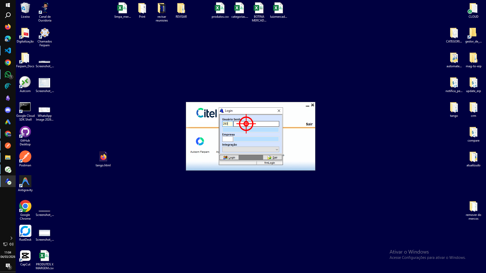
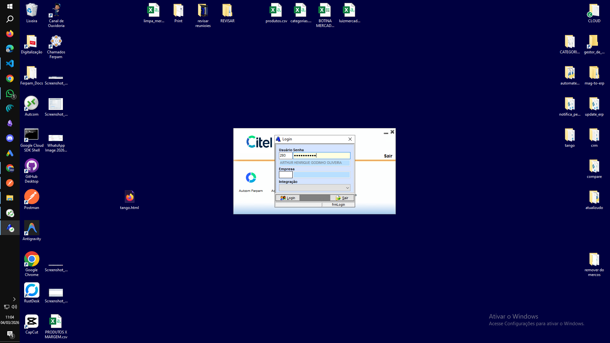
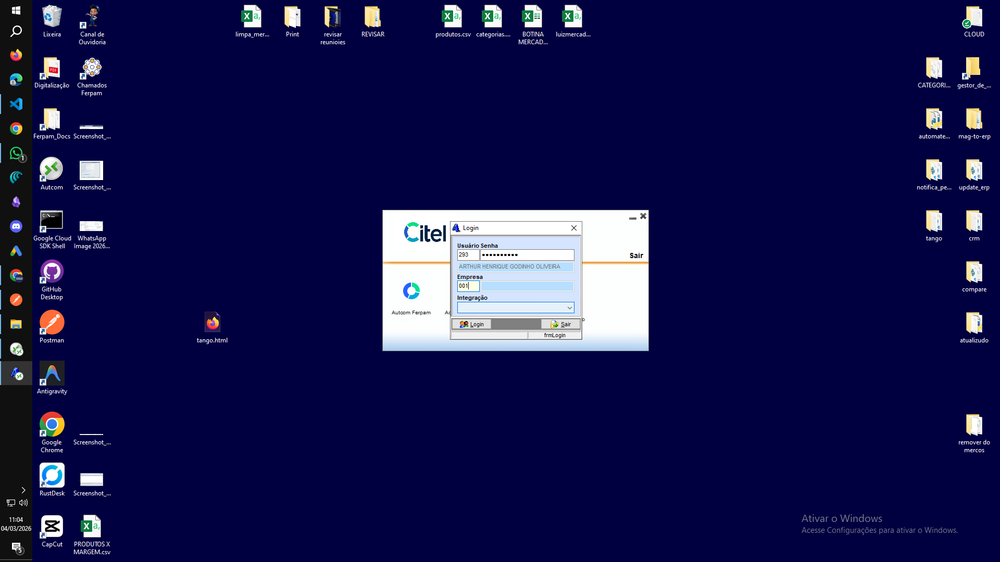
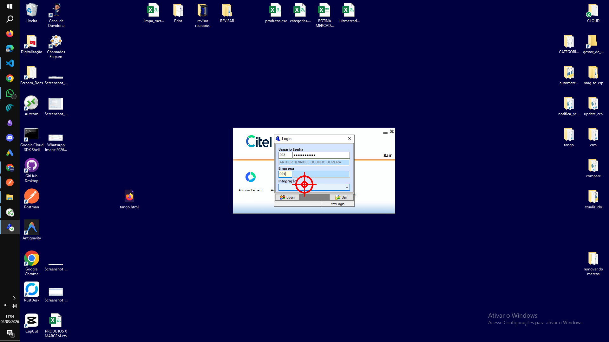
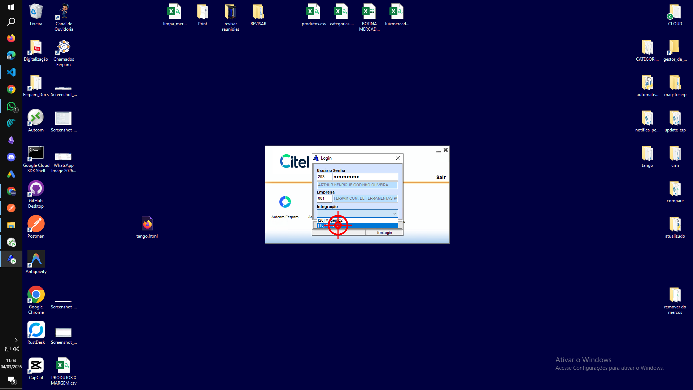
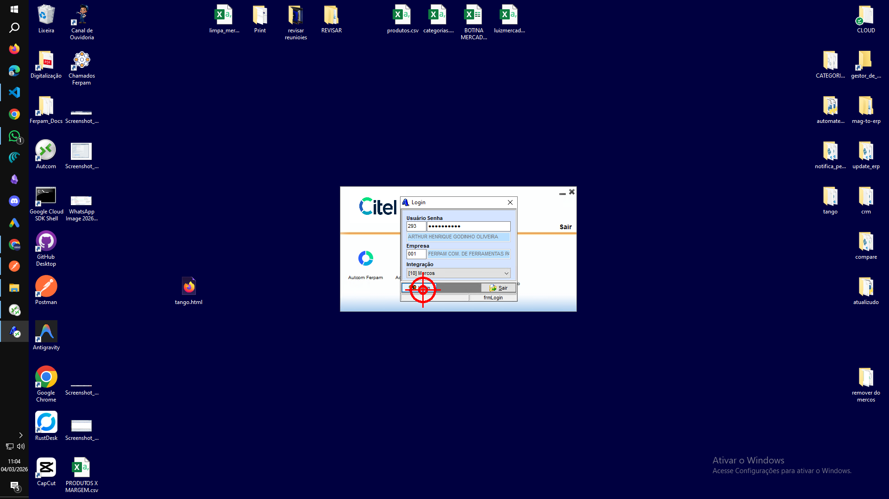

# Tutorial gravado (Tango-like)

_Gerado em 2026-03-04 11:04:48_

## Passo 1 — CLICK
Clique (left) em (101, 322).
- Janela: Program Manager

## Passo 2 — CLICK
Clique (left) em (994, 561).
- Janela: Applications (Remoto)

## Passo 3 — CLICK
Clique (left) em (886, 490).
- Janela: Login (Remoto)

## Passo 4 — TYPE
Digite: “293”
- Janela: Login (Remoto)

## Passo 5 — CLICK
Clique (left) em (972, 489).
- Janela: Login (Remoto)

## Passo 6 — TYPE
Digite: “suporte293”
- Janela: Login (Remoto)

## Passo 7 — CLICK
Clique (left) em (885, 554).
- Janela: Login (Remoto)

## Passo 8 — TYPE
Digite: “001”
- Janela: Login (Remoto)

## Passo 9 — CLICK
Clique (left) em (959, 582).
- Janela: Login (Remoto)

## Passo 10 — CLICK
Clique (left) em (936, 623).
- Janela: Login (Remoto)

## Passo 11 — CLICK
Clique (left) em (913, 627).
- Janela: Login (Remoto)

