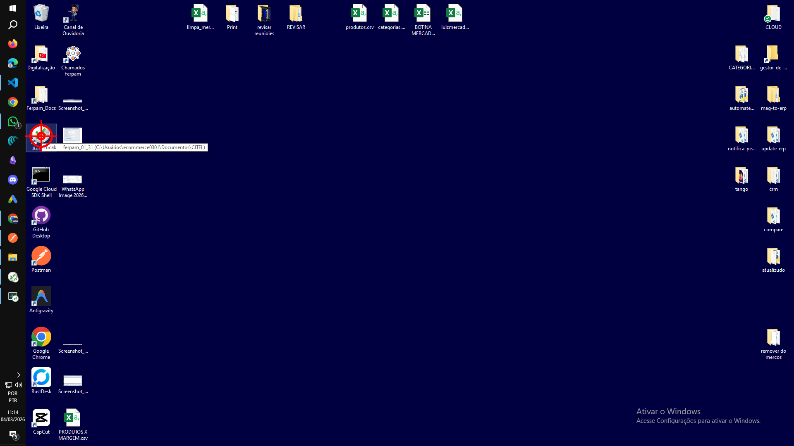
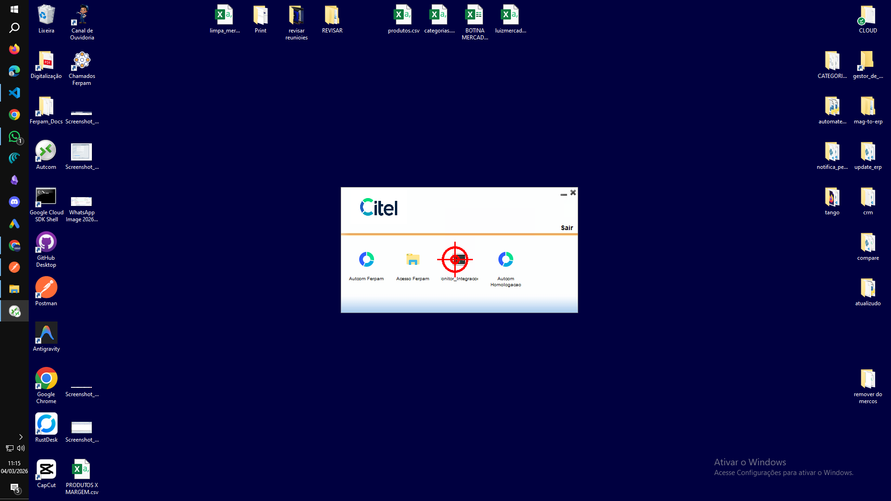
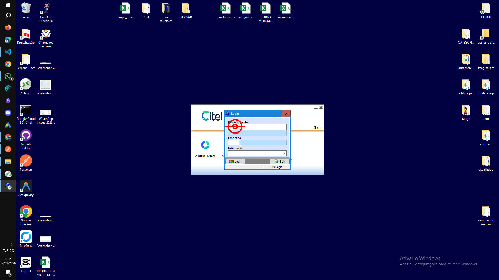
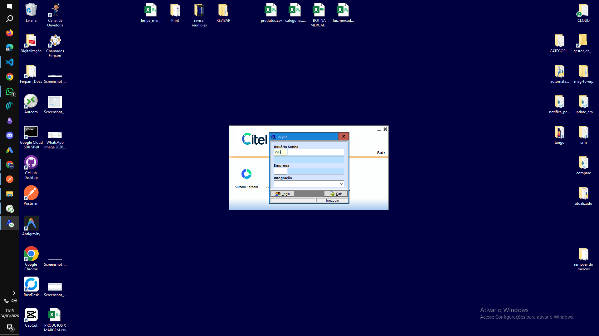
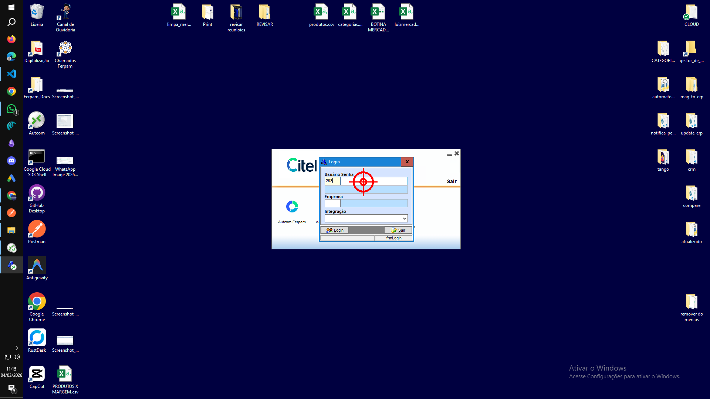
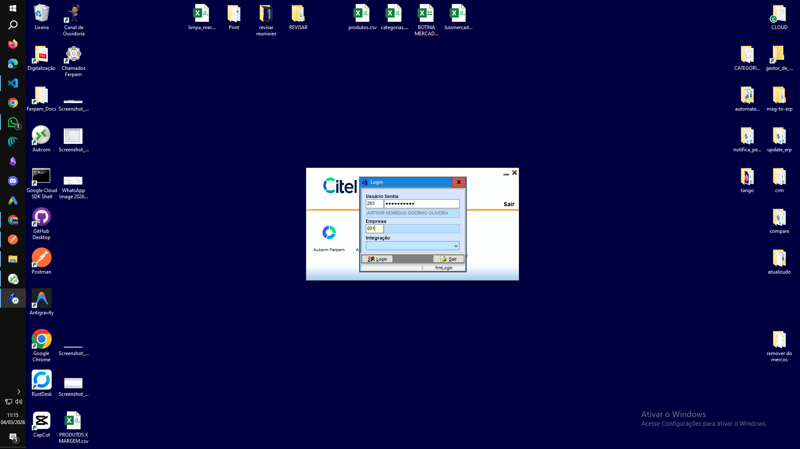
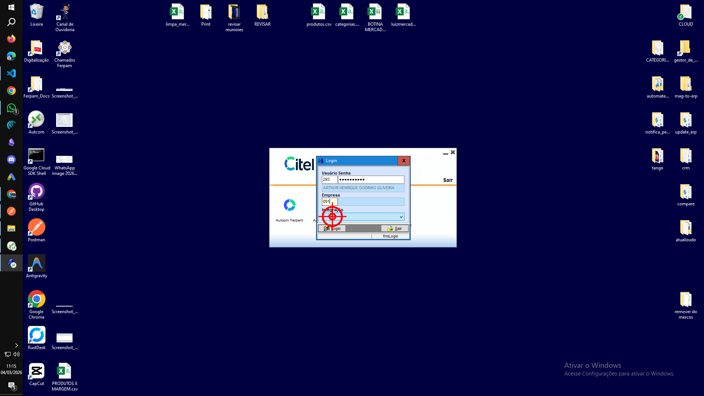
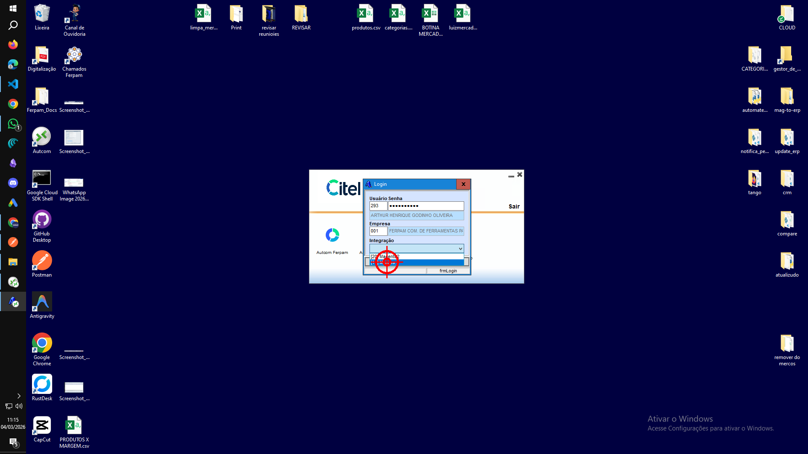
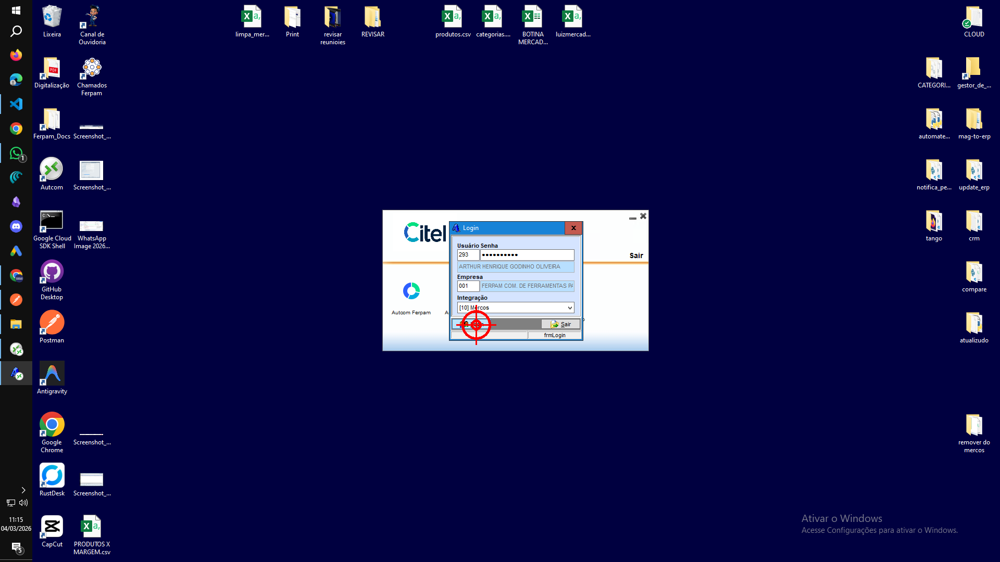

# Tutorial gravado (Tango-like)

_Gerado em 2026-03-04 11:15:24_

## Passo 1 — CLICK
Clique (left) em (99, 329).

## Passo 2 — CLICK
Clique (left) em (980, 559).
- Janela: Applications (Remoto)

## Passo 3 — CLICK
Clique (left) em (904, 487).
- Janela: Login (Remoto)

## Passo 4 — TYPE
Digite: “293”
- Janela: Login (Remoto)

## Passo 5 — CLICK
Clique (left) em (982, 492).
- Janela: Login (Remoto)

## Passo 6 — TYPE
Digite: “suporte293”
- Janela: Login (Remoto)

## Passo 7 — CLICK
Clique (left) em (911, 553).
- Janela: Login (Remoto)

## Passo 8 — TYPE
Digite: “001”
- Janela: Login (Remoto)

## Passo 9 — CLICK
Clique (left) em (906, 590).
- Janela: Login (Remoto)

## Passo 10 — CLICK
Clique (left) em (919, 623).
- Janela: Login (Remoto)

## Passo 11 — CLICK
Clique (left) em (914, 624).
- Janela: Login (Remoto)

