# Tutorial gravado (Tango-like)

_Gerado em 2026-03-04 12:23:32_

## Passo 1 — SCROLL
Role para baixo na posição (770, 747).
- Janela: Ferpam: Ferramentas, Parafusos, Máquinas, Irrigação, Energia Solar. - Google Chrome

## Passo 2 — SCROLL
Role para baixo na posição (769, 747).
- Janela: Ferpam: Ferramentas, Parafusos, Máquinas, Irrigação, Energia Solar. - Google Chrome

## Passo 3 — SCROLL
Role para baixo na posição (769, 747).
- Janela: Ferpam: Ferramentas, Parafusos, Máquinas, Irrigação, Energia Solar. - Google Chrome

## Passo 4 — SCROLL
Role para baixo na posição (769, 747).
- Janela: Ferpam: Ferramentas, Parafusos, Máquinas, Irrigação, Energia Solar. - Google Chrome
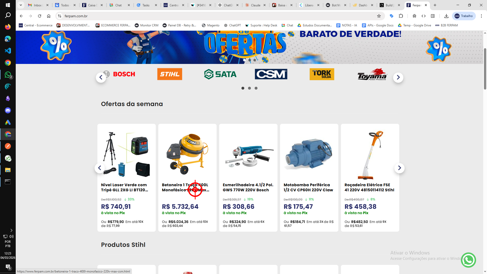

## Passo 5 — CLICK
Clique (left) em (1007, 556).
- Janela: Ferpam: Ferramentas, Parafusos, Máquinas, Irrigação, Energia Solar. - Google Chrome
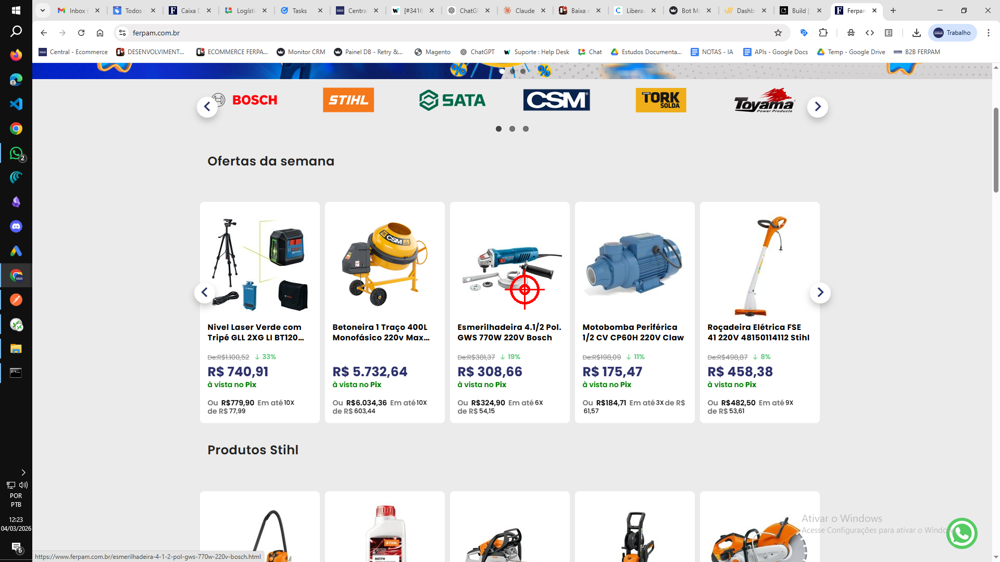

## Passo 6 — SCROLL
Role para baixo na posição (1005, 556).
- Janela: Esmerilhadeira 4.1/2 Pol. GWS 770W 220V Bosch - Google Chrome
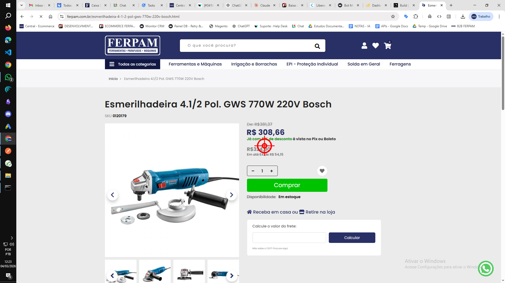

## Passo 7 — SCROLL
Role para baixo na posição (1001, 556).
- Janela: Esmerilhadeira 4.1/2 Pol. GWS 770W 220V Bosch - Google Chrome
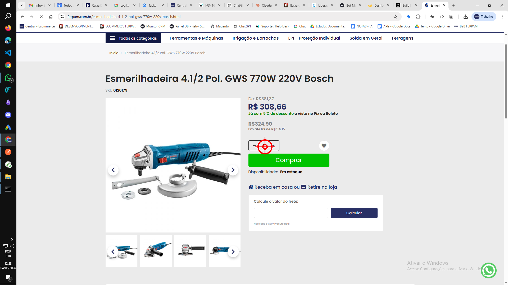

## Passo 8 — CLICK
Clique (left) em (1028, 708).
- Janela: Esmerilhadeira 4.1/2 Pol. GWS 770W 220V Bosch - Google Chrome
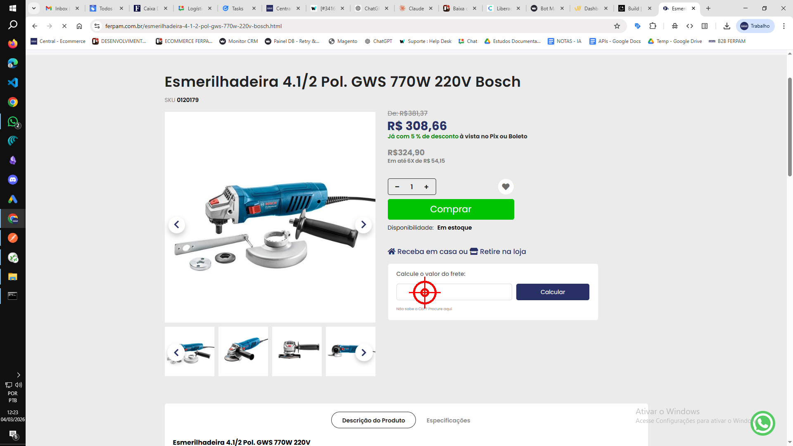

## Passo 9 — TYPE
Digite: “77020022”
- Janela: Esmerilhadeira 4.1/2 Pol. GWS 770W 220V Bosch - Google Chrome
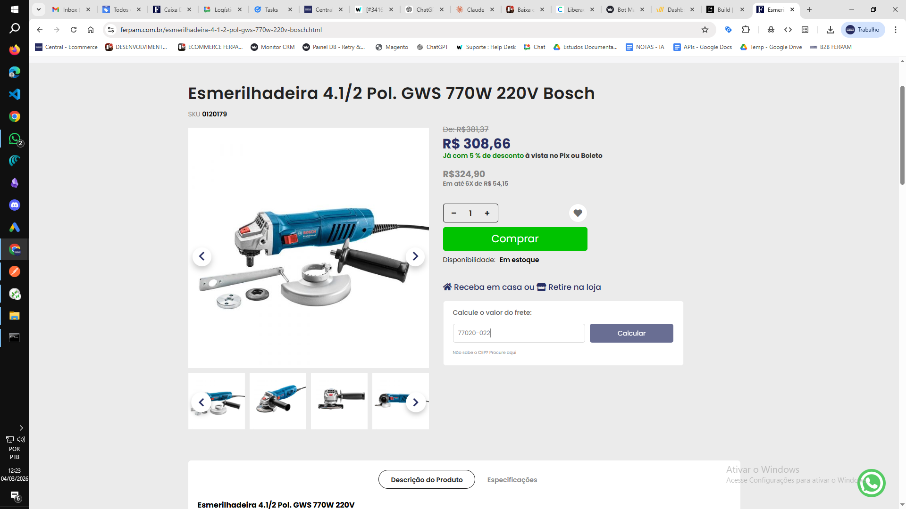

## Passo 10 — CLICK
Clique (left) em (1294, 697).
- Janela: Esmerilhadeira 4.1/2 Pol. GWS 770W 220V Bosch - Google Chrome
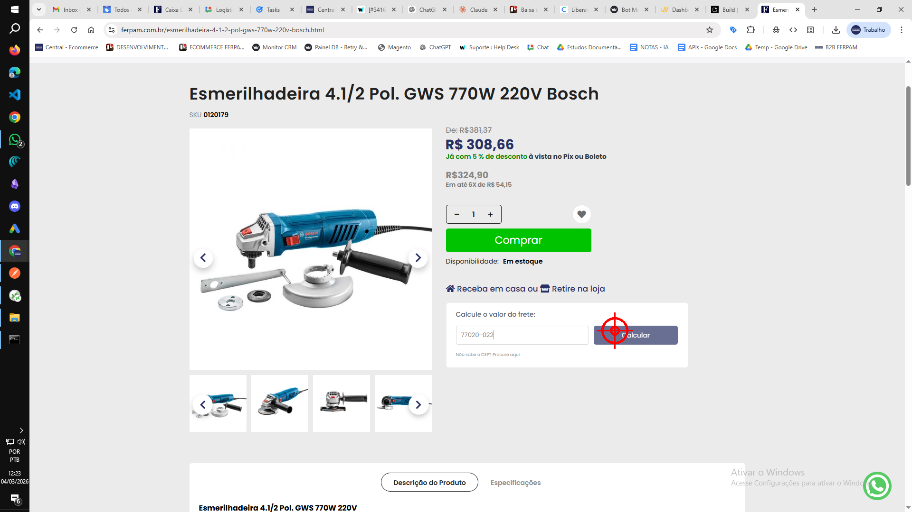

## Passo 11 — SCROLL
Role para baixo na posição (1287, 657).
- Janela: Esmerilhadeira 4.1/2 Pol. GWS 770W 220V Bosch - Google Chrome
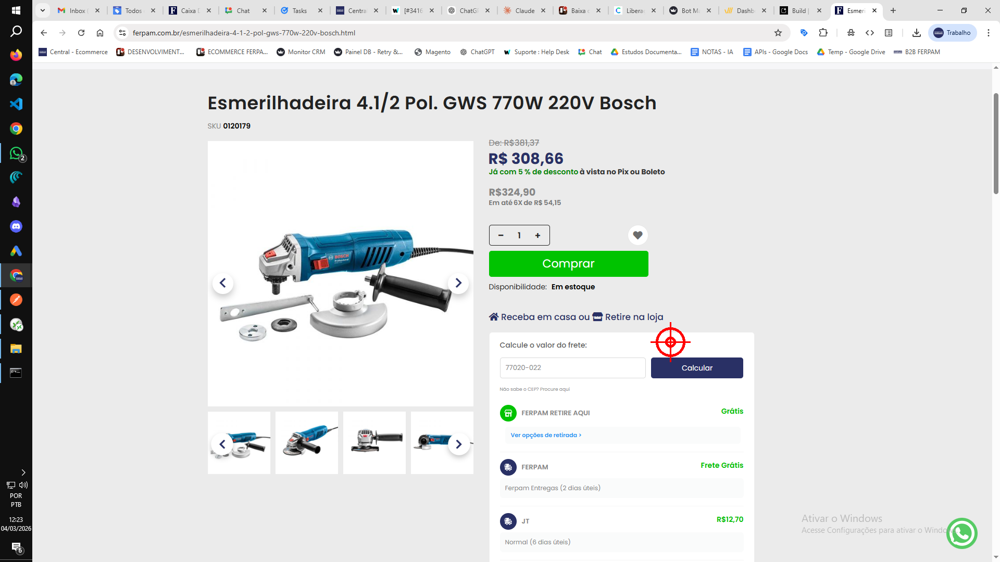

## Passo 12 — SCROLL
Role para baixo na posição (1286, 657).
- Janela: Esmerilhadeira 4.1/2 Pol. GWS 770W 220V Bosch - Google Chrome

## Passo 13 — SCROLL
Role para baixo na posição (1273, 664).
- Janela: Esmerilhadeira 4.1/2 Pol. GWS 770W 220V Bosch - Google Chrome
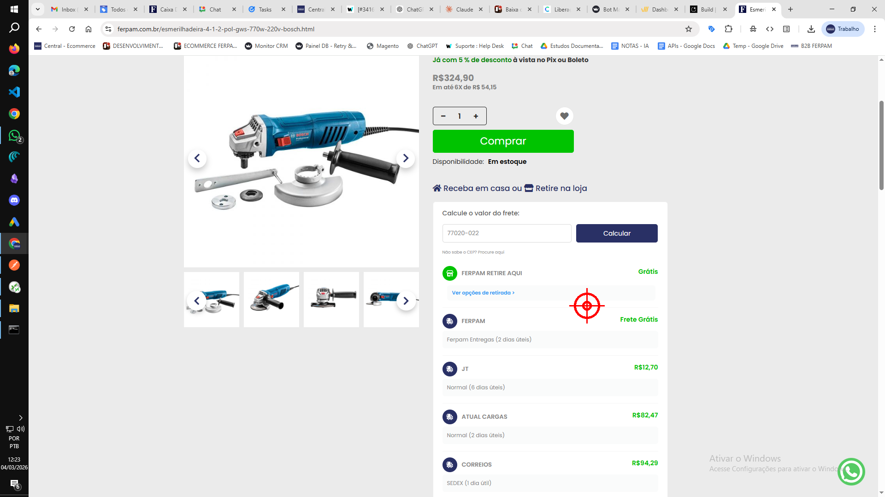

## Passo 14 — CLICK
Clique (left) em (1492, 678).
- Janela: Esmerilhadeira 4.1/2 Pol. GWS 770W 220V Bosch - Google Chrome
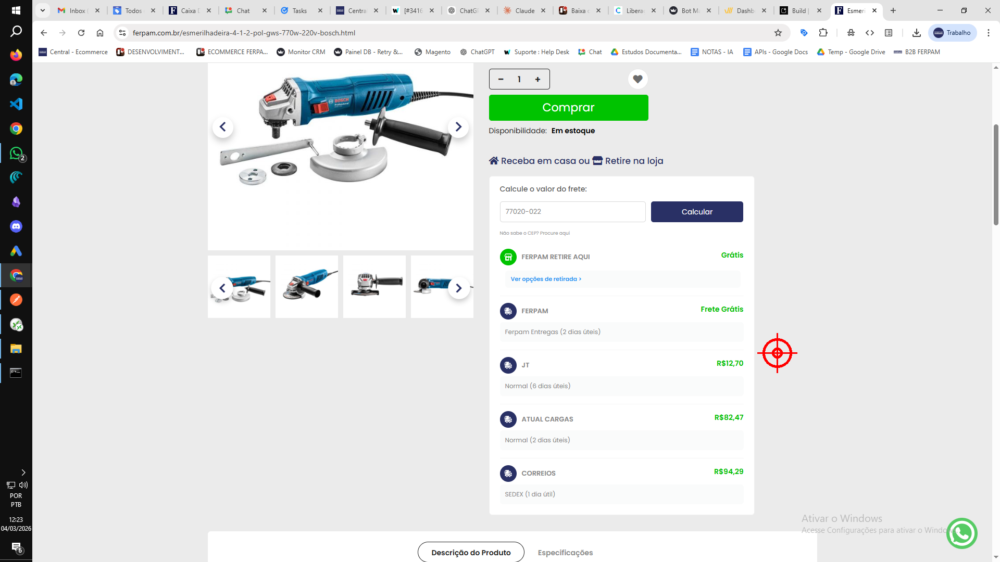

## Passo 15 — TYPE
Digite: “[TAB]”
- Janela: C:\Windows\system32\cmd.exe
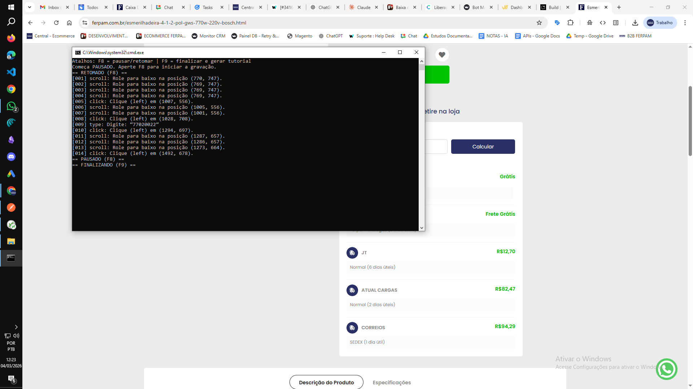
