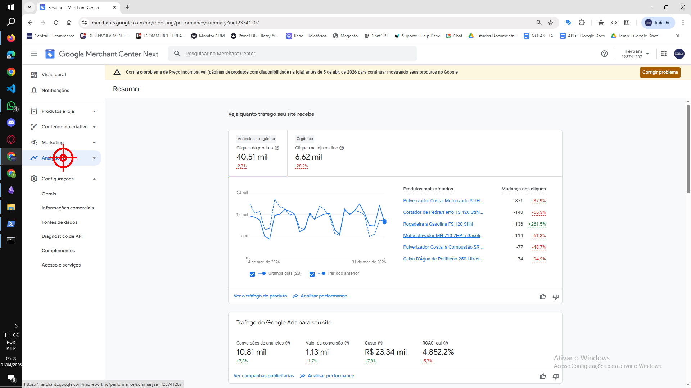
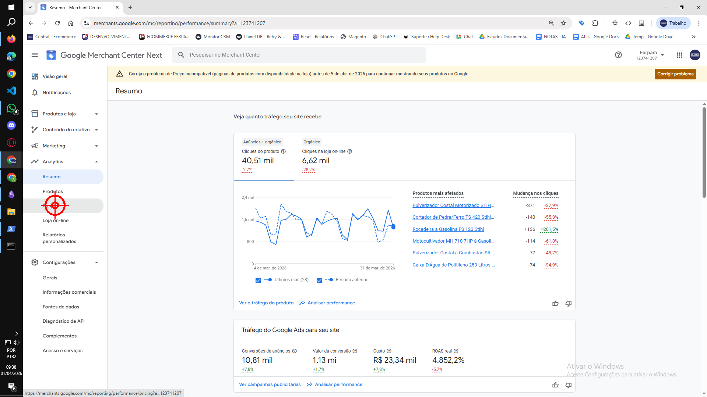
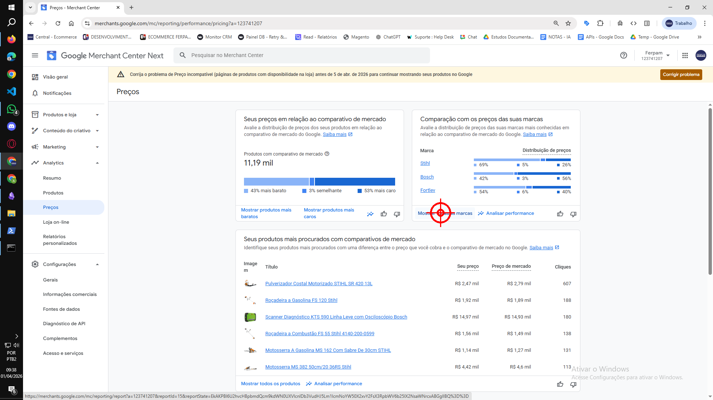
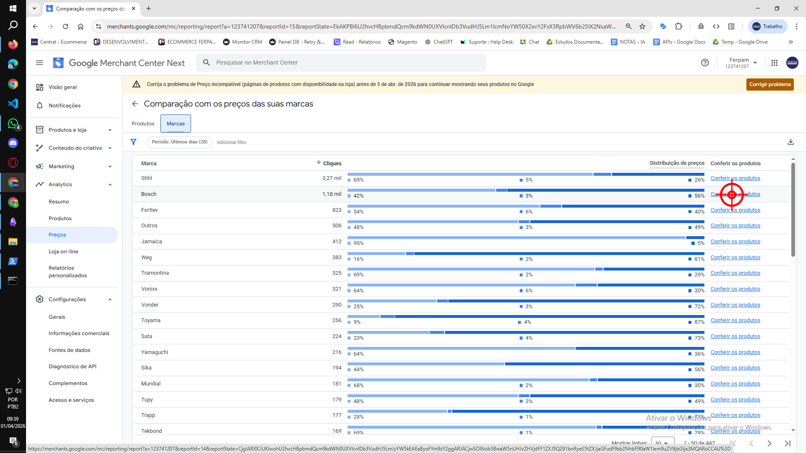
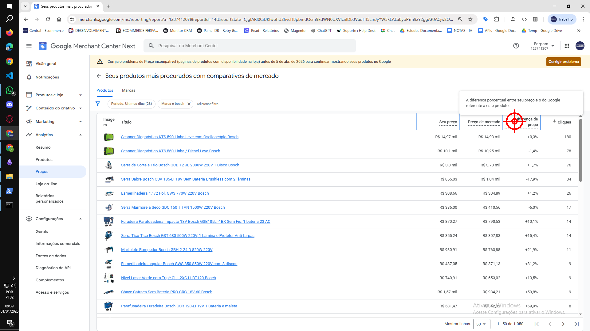
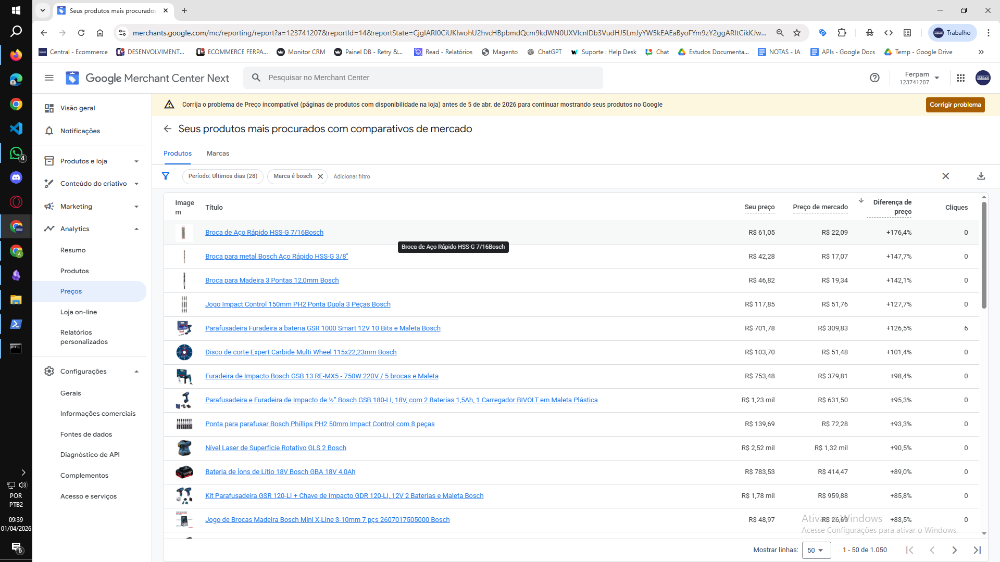
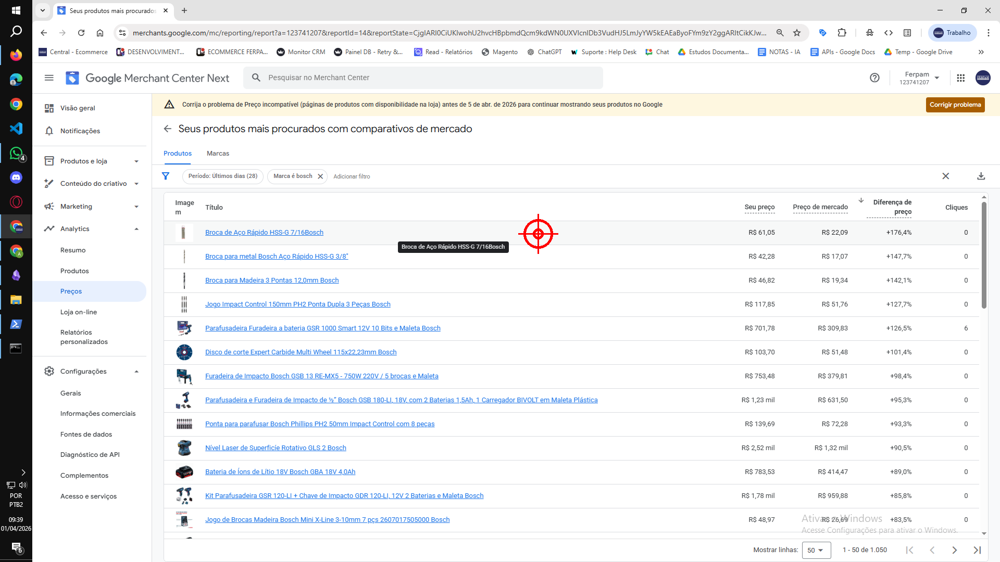

# Tutorial gravado (Tango-like)

_Gerado em 2026-04-01 09:39:51_

## Passo 1 — CLICK
Clique (left) em (175, 439).
- Janela: Resumo - Merchant Center - Google Chrome

## Passo 2 — CLICK
Clique (left) em (149, 558).
- Janela: Resumo - Merchant Center - Google Chrome

## Passo 3 — CLICK
Clique (left) em (1186, 574).
- Janela: Preços - Merchant Center - Google Chrome

## Passo 4 — CLICK
Clique (left) em (1743, 464).
- Janela: Comparação com os preços das suas marcas - Merchant Center - Google Chrome

## Passo 5 — CLICK
Clique (left) em (1674, 395).
- Janela: Seus produtos mais procurados com comparativos de mercado - Merchant Center - Google Chrome

## Passo 6 — TYPE
Digite: “.”
- Janela: Seus produtos mais procurados com comparativos de mercado - Merchant Center - Google Chrome

## Passo 7 — CLICK
Clique (left) em (1033, 449).
- Janela: Seus produtos mais procurados com comparativos de mercado - Merchant Center - Google Chrome

